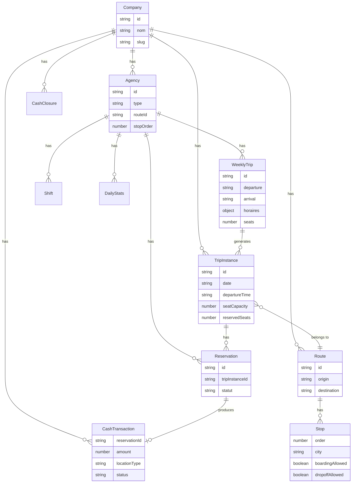
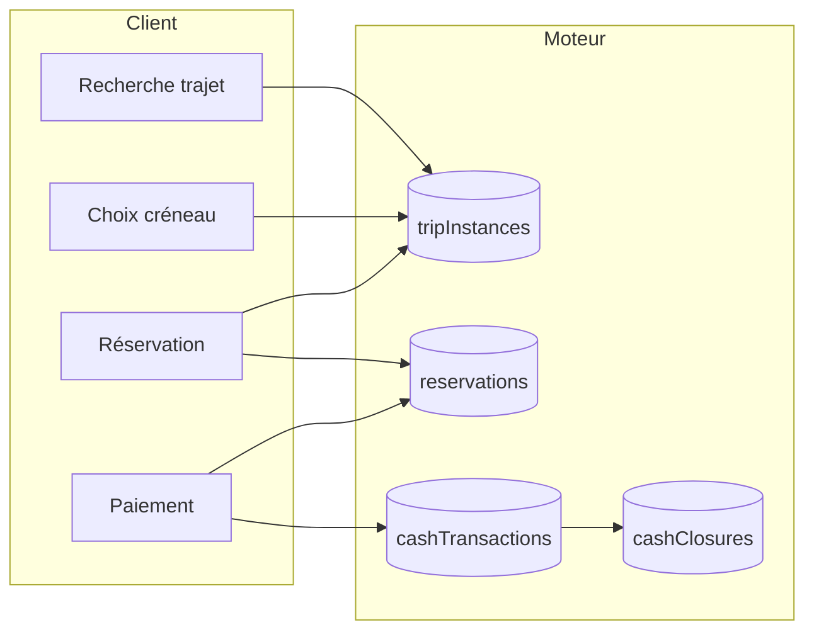

# Audit complet du système TELIYA

Document d'analyse de l'architecture et des fonctionnalités actuellement implémentées dans le code. Ce document sert de base pour les évolutions futures. **Aucune modification de code n'a été effectuée.**

---

## 1. Structure Firestore actuelle

Toutes les collections et sous-collections réellement utilisées dans le code sont listées ci-dessous.

| Chemin Firestore | Champs principaux | Type / Rôle | Fichiers principaux |
|------------------|-------------------|-------------|---------------------|
| **companies** | nom, slug, nomCompagnie, villesDisponibles, etc. | Racine compagnie | PublicCompanyPage, AdminCompagniesPage, index.ts |
| **companies/{companyId}/agences** | nom, nomAgence, type, routeId?, stopOrder?, city? | Agences / points de vente | CompagnieAgencesPage, AgenceGuichetPage, EscaleDashboardPage, FindReservationPage |
| **companies/{companyId}/agences/{agencyId}/weeklyTrips** | id, departure, arrival, departureCity, arrivalCity, price, places, seats, horaires, routeId?, agencyId, active, status | Template de trajet hebdo | generateWeeklyTrips, AgenceTrajetsPage, AgenceGuichetPage, ManagerCockpitPage, BoardingDashboardPage, useVilleOptions |
| **companies/{companyId}/agences/{agencyId}/reservations** | trajetId, date, heure, depart, arrivee, nomClient, telephone, seatsGo, seatsReturn, montant, statut, tripInstanceId?, cashTransactionId?, paymentStatus?, paymentMethod?, canal, guichetierId, shiftId, referenceCode, qrCode | Réservations par agence | guichetReservationService, reservations.ts, ReservationClientPage, AgenceGuichetPage, ManagerOperationsPage, BoardingScanPage |
| **companies/{companyId}/agences/{agencyId}/reservationLogs** | type, reservationId, prev, next, reason, by, createdAt | Journal d'audit réservations | reservations.ts |
| **companies/{companyId}/agences/{agencyId}/shifts** | statut, ouvert à, fermé à, etc. | Sessions guichet | sessionService, AgenceGuichetPage, ManagerCockpitPage |
| **companies/{companyId}/agences/{agencyId}/boardingClosures** | Liste fermetures embarquement | Fermetures liste embarquement | ManagerCockpitPage, useManagerAlerts, ManagerOperationsPage |
| **companies/{companyId}/agences/{agencyId}/boardingLogs** | Logs d'embarquement | Logs scan / embarquement | AgenceEmbarquementPage |
| **companies/{companyId}/agences/{agencyId}/dailyStats** | totalRevenue, ticketRevenue, courierRevenue, totalPassengers, totalSeats, validatedSessions, activeSessions (document ID = date YYYY-MM-DD) | Agrégats journaliers par agence | dailyStats.ts, backfillDailyStatsRevenue, guichetReservationService, courierSessionService |
| **companies/{companyId}/agences/{agencyId}/users** | Référence utilisateurs affectés à l'agence | Personnel agence | ManagerTeamPage, FleetCrewPage |
| **companies/{companyId}/agences/{agencyId}/cashSessions** | Sessions caisse (legacy / cash control) | Contrôle caisse agence | cashSessionService, CashSessionsPage |
| **companies/{companyId}/agences/{agencyId}/cashSessionExpenses** | Dépenses déduites de la session | Dépenses session | cashSessionService |
| **companies/{companyId}/tripInstances** | companyId, agencyId, routeId?, routeDeparture, routeArrival, date, departureTime, seatCapacity, capacitySeats, reservedSeats, passengerCount, parcelCount, weeklyTripId, vehicleId, status, price? | Trajet réel (exécution jour + créneau) — **source de vérité places** | tripInstanceService, ReservationClientPage, AgenceGuichetPage, EscaleDashboardPage, guichetReservationService, reservations.ts, ReservationsEnLignePage |
| **companies/{companyId}/routes** | origin, destination, distanceKm, estimatedDurationMinutes, status, departureCity, arrivalCity | Routes réseau (origine → destination) | routesService, CompanyRoutesPage, EscaleDashboardPage |
| **companies/{companyId}/routes/{routeId}/stops** | city, cityId?, order, distanceFromStartKm, estimatedArrivalOffsetMinutes, boardingAllowed, dropoffAllowed | Escales d'une route | routeStopsService, CompanyRoutesPage, guichetReservationService, EscaleDashboardPage |
| **companies/{companyId}/cashTransactions** | reservationId, tripInstanceId?, amount, currency, paymentMethod, locationType, locationId, routeId?, date, status (paid/refunded), createdBy, createdAt | Encaissements (vente → caisse) | cashService, guichetReservationService, ReservationsEnLignePage, reservations.ts |
| **companies/{companyId}/cashClosures** | locationType, locationId, date, expectedAmount, declaredAmount, difference, createdBy, createdAt | Clôtures journalières caisse | cashService, CashSummaryCard, CompanyCashPage |
| **companies/{companyId}/cashRefunds** | reservationId, amount, locationType, locationId, createdBy, reason?, date?, createdAt | Remboursements (annulation avec remboursement) | cashService, reservations.ts |
| **companies/{companyId}/cashTransfers** | locationType, locationId, amount, transferMethod, createdBy, date?, createdAt | Transferts vers la compagnie | cashService, CompanyCashPage |
| **companies/{companyId}/notifications** | Notifications compagnie | Notifications | companyNotifications.ts, useUnreadCompanyNotificationsCount |
| **companies/{companyId}/personnel** | Utilisateurs / rôles liés à la compagnie | Personnel compagnie | index.ts (Cloud Functions), ManagerOperationsPage |
| **companies/{companyId}/fleetVehicles** | Véhicules flotte (legacy, voir vehicles) | Flotte véhicules | FleetAssignmentPage, FleetDashboardPage, fleetStateMachine, AgenceEmbarquementPage |
| **companies/{companyId}/fleetMovements** | Mouvements véhicules | Historique mouvements | fleetStateMachine, OperationsFlotteLandingPage |
| **companies/{companyId}/companyBanks** | Comptes bancaires compagnie | Trésorerie | CEOTreasuryPage, ComptaPage, TreasurySupplierPaymentPage |
| **companies/{companyId}/financialAccounts** | Comptes financiers | Comptabilité | financialAccounts.ts, CEOTreasuryPage |
| **companies/{companyId}/financialMovements** | Mouvements financiers | Mouvements trésorerie | financialMovements, expenses, treasuryTransferService |
| **companies/{companyId}/expenses** | Dépenses compagnie | Dépenses | expenses.ts, operationalProfitabilityService |
| **companies/{companyId}/revenue/events** | Événements revenus | Revenus (module revenue) | firestorePaths (revenue) |
| **companies/{companyId}/imagesBibliotheque** | Images bibliothèque | Médias compagnie | mediaUpload.service |
| **companies/{companyId}/avis** | Avis clients | Avis public | AvisListePublic, reviews.service |
| **companies/{companyId}/subscription/current** | Abonnement actuel | Plan / abo | subscription types |
| **companies/{companyId}/usage/{month}** | Usage (Cloud Functions) | Facturation / usage | index.ts |
| **villes** | Noms de villes (document ID = nom normalisé) | Référentiel villes | villes.service.ts, useVilleOptions |
| **plans** | Plans tarifaires plateforme | Plans abonnement | PlansManager, AdminSubscriptionsManager |
| **medias** | Médias plateforme (hero, etc.) | Médias plateforme | MediaPage, media.service |
| **invitations** | Invitations utilisateurs | Onboarding | AcceptInvitationPage, AdminSubscriptionsManager |
| **users** | Profils utilisateurs (Firebase Auth + custom claims / Firestore) | Utilisateurs | ManagerTeamPage, AuthContext |
| **agents** | Agents plateforme (admin) | Admin | AdminAgentsPage |
| **messages** | Messages contact | Contact | contact.service |

---

## 2. Moteur des trajets

### 2.1 weeklyTrips

- **Emplacement** : `companies/{companyId}/agences/{agencyId}/weeklyTrips`
- **Rôle** : **Template** de trajet : origine, destination, prix, capacité, horaires par jour (`horaires` = map jour → liste d'heures).
- **Création** : `generateWeeklyTrips` (depuis `AgenceTrajetsPage` ou flux création trajet agence). Peut être lié à une `routeId` ; dans ce cas `departure`/`arrival` viennent de la route.
- **Champs clés** : `departure`, `arrival`, `departureCity`, `arrivalCity`, `price`, `places`/`seats`, `horaires`, `routeId?`, `agencyId`, `active`, `status`.

### 2.2 tripInstances

- **Emplacement** : `companies/{companyId}/tripInstances`
- **Rôle** : **Trajet réel** pour une date et un créneau horaire. **Source de vérité** pour les places : `seatCapacity` / `capacitySeats`, `reservedSeats`, `passengerCount`.
- **Création** : **Lazy** via `getOrCreateTripInstanceForSlot` lorsqu'un client ou le guichet choisit un créneau (date + heure). ID déterministe si `weeklyTripId` fourni : `buildTripInstanceId(weeklyTripId, date, departureTime)`.
- **Champs clés** : `companyId`, `agencyId`, `routeId?`, `routeDeparture`, `routeArrival`, `date`, `departureTime`, `seatCapacity`/`capacitySeats`, `reservedSeats`, `passengerCount`, `weeklyTripId`, `vehicleId`, `status`, `price`.

### 2.3 Flux : route → weeklyTrip → tripInstance → réservation

1. **Route** (optionnel) : définie dans `companies/{companyId}/routes` avec des **stops** (escales). La route donne origine/destination et ordre des villes.
2. **WeeklyTrip** : créé par l’agence (logistique) pour une liaison (ex. Bamako–Sikasso), avec horaires par jour, prix, capacité. Peut référencer `routeId`.
3. **TripInstance** : créé à la demande quand un utilisateur (client ou guichet) sélectionne une date + un créneau. Si le créneau correspond à un weeklyTrip, l’instance est créée avec `weeklyTripId` et reçoit la capacité du template. Les places restantes = `seatCapacity - reservedSeats`.
4. **Réservation** : liée à un `tripInstanceId`. À la création de la réservation, `incrementReservedSeats(companyId, tripInstanceId, seats)` est appelé (transaction). À l’annulation/refus, `decrementReservedSeats` est appelé.

### 2.4 Génération des créneaux

- **Côté client** (`ReservationClientPage`) : pour une date et une paire origine/destination, appel à `listTripInstancesByRouteAndDate(companyId, departureCity, arrivalCity, date)`. Si des instances existent, elles sont affichées avec `remainingSeats = seatCapacity - reservedSeats`. Sinon, les créneaux peuvent être dérivés des weeklyTrips (horaires du jour) et à la sélection d’un créneau, `getOrCreateTripInstanceForSlot` crée l’instance puis la réservation est créée avec ce `tripInstanceId`.
- **Côté guichet** (`AgenceGuichetPage`) : même logique : recherche par `listTripInstancesByRouteIdAndDate` (si route) ou par villes + date ; `getOrCreateTripInstanceForSlot` en lazy ; création réservation avec `tripInstanceId` puis `incrementReservedSeats`.

### 2.5 Source de vérité

- **Places** : **tripInstances** uniquement. `remainingSeats = seatCapacity - reservedSeats`. Les agrégats (dailyStats) et l’affichage ne doivent plus calculer les places à partir des réservations.
- **weeklyTrips** : uniquement template (horaires, prix, capacité) pour générer ou alimenter les tripInstances.

---

## 3. Système des routes et escales

### 3.1 Structure d’une route

- **Document** : `companies/{companyId}/routes/{routeId}`
- **Champs** : `origin`, `destination`, `distanceKm`, `estimatedDurationMinutes`, `status` (ACTIVE/DISABLED). Champs de compatibilité : `departureCity`, `arrivalCity`, `distance`, `estimatedDuration`.
- **Normalisation** : les noms de villes sont capitalisés via `capitalizeCityName` (ex. "bamako" → "Bamako").

### 3.2 Structure d’une escale (stop)

- **Sous-collection** : `companies/{companyId}/routes/{routeId}/stops/{stopId}`
- **Champs** : `city`, `cityId?`, `order` (entier strictement croissant), `distanceFromStartKm`, `estimatedArrivalOffsetMinutes`, `boardingAllowed` (défaut true), `dropoffAllowed` (défaut true).
- **Contraintes** : ordre croissant ; premier stop = origine, dernier = destination ; minimum 2 stops (origine + destination).

### 3.3 Ordre des stops

- Les stops sont toujours retournés triés par `order` (asc). L’ordre 1 = origine, dernier ordre = destination. Les escales intermédiaires ont des ordres 2, 3, …

### 3.4 boardingAllowed / dropoffAllowed

- **boardingAllowed** : si true, les passagers peuvent monter à cette escale (vente possible depuis cette ville).
- **dropoffAllowed** : si true, les passagers peuvent descendre à cette escale (destination possible). Pour la vente depuis une escale, seules les destinations avec `order > stopOrder` **et** `dropoffAllowed !== false` sont proposées (`getStopsWithOrderGreaterThan` / `getEscaleDestinations`).

### 3.5 Vente depuis une escale

- L’agence peut être de **type escale** (`type: "escale"`) avec `routeId` et `stopOrder` renseignés.
- **EscaleDashboardPage** : affiche les tripInstances du jour pour la route de l’escale ; pour chaque bus, heure de passage à l’escale (départ + offset), places restantes, bouton « Vendre billet » qui redirige vers le guichet avec `fromEscale: true`, `tripInstanceId`, `routeId`, `stopOrder`, `originEscaleCity`.
- **Guichet (fromEscale)** : origine fixée à la ville du stop `stopOrder` ; destinations = `getEscaleDestinations(companyId, routeId, stopOrder)` (order > stopOrder et dropoffAllowed).
- **Validation côté service** : `validateEscaleAgentReservation` dans `guichetReservationService` vérifie que le départ = ville du stop de l’escale, que l’arrivée est dans les destinations autorisées, et que le `tripInstance.routeId` correspond à l’agence.

---

## 4. Système des réservations

### 4.1 Création en ligne (ReservationClientPage)

- L’utilisateur choisit origine, destination, date. Les trajets affichés viennent de `listTripInstancesByRouteAndDate` (ou dérivés des weeklyTrips + lazy création).
- À la sélection d’un créneau : `getOrCreateTripInstanceForSlot` pour obtenir ou créer le tripInstance ; création d’un brouillon de réservation (statut en attente) avec `tripInstanceId`.
- Après paiement (upload preuve, confirmation par la compagnie) : mise à jour réservation (statut confirmé/payé), `incrementReservedSeats`, création `cashTransaction`, mise à jour `paymentStatus`, `paymentMethod`, `cashTransactionId` sur la réservation.

### 4.2 Création guichet (AgenceGuichetPage + guichetReservationService)

- L’agent a une session (shift) ouverte. Recherche trajets par date + origine/destination (ou par route si mode escale).
- Créneaux = tripInstances (idem client). À la vente : `createGuichetReservation` avec `tripInstanceId`, puis `incrementReservedSeats`, mise à jour dailyStats, création `cashTransaction`, liaison réservation ↔ cashTransaction.

### 4.3 Statuts réservation

- Statuts utilisés dans le code : brouillon / en attente, preuve_recue, confirme, paye, annule, etc. Transitions gérées par `reservationStatusUtils` / `reservationStatutService` ; annulation via `cancelReservation` dans `reservations.ts`.

### 4.4 Relation avec tripInstance

- Chaque réservation confirmée/payée pointe vers un `tripInstanceId`. La création de réservation incrémente `reservedSeats` (et `passengerCount`) du tripInstance ; l’annulation (ou le refus) décrémente.

---

## 5. Système financier (caisse)

### 5.1 cashTransactions

- **Création** : à chaque réservation guichet confirmée (`createGuichetReservation`) et à chaque confirmation de réservation en ligne avec paiement (`ReservationsEnLignePage` → `createCashTransaction`).
- **Champs** : reservationId, tripInstanceId?, amount, currency, paymentMethod, locationType (agence/escale), locationId (agencyId), routeId?, date (YYYY-MM-DD), status (paid/refunded), createdBy, createdAt.
- **Lien réservation** : la réservation stocke `cashTransactionId`, `paymentStatus`, `paymentMethod` lorsque applicable.

### 5.2 Remboursements et statut

- Lors d’une annulation avec remboursement (`cancelReservation`) : `createCashRefund` et `markCashTransactionRefunded` si `cashTransactionId` présent. Les totaux « caisse » excluent les transactions en statut `refunded`.

### 5.3 Clôture de caisse

- **cashClosures** : document par clôture avec locationType, locationId, date, expectedAmount (somme des transactions du jour), declaredAmount (saisi par l’agent), difference.
- **CashSummaryCard** : utilisé sur le dashboard agence et le dashboard escale ; affiche ventes du jour, montant en caisse, dernière clôture ; bouton « Clôturer la caisse » pour les rôles autorisés (guichetier, chefAgence, escale_agent, etc.).

### 5.4 Tableau de bord compagnie (CompanyCashPage)

- Vue Finance / Caisse : filtrage par date ; affichage argent en caisse (somme transactions non remboursées), argent transféré (cashTransfers), argent remboursé (cashRefunds), argent clôturé (somme declaredAmount des clôtures), écarts (différences). Tableaux : revenus par route, par point de vente (agence/escale), clôtures du jour.

### 5.5 cashTransfers

- Collection pour enregistrer les transferts d’argent du point de vente vers la compagnie (mobile_money, bank, cash). Utilisée pour les indicateurs « argent transféré » côté compagnie.

---

## 6. Rôles et permissions

### 6.1 Liste des rôles (roles-permissions.ts)

| Rôle | Type | Modules / accès |
|------|------|------------------|
| admin_platforme | Plateforme | dashboard, statistiques, paramètres |
| admin_compagnie | Compagnie | dashboard, statistiques, agences, personnel, paramètres |
| financial_director | Compagnie | dashboard, reservations, finances, depenses, statistiques |
| company_accountant | Compagnie | dashboard, reservations, finances, depenses, statistiques |
| responsable_logistique | Compagnie | dashboard, fleet |
| chef_garage | Compagnie | dashboard, fleet |
| chefAgence | Agence | dashboard, reservations, finances, guichet, embarquement, fleet, personnel |
| superviseur | Agence | dashboard, reservations, finances, guichet, embarquement, fleet, personnel |
| agentCourrier | Agence | dashboard, reservations |
| agency_accountant | Agence | dashboard, finances, depenses, statistiques |
| guichetier | Agence | guichet, reservations |
| chefEmbarquement | Agence | boarding, embarquement, reservations |
| agency_fleet_controller | Agence | fleet |
| escale_agent | Agence (escale) | dashboard, guichet, reservations, boarding |
| unauthenticated | — | — |
| user | Défaut | — |

### 6.2 routePermissions (accès par zone)

- **compagnieLayout** : admin_compagnie, admin_platforme  
- **garageLayout** : responsable_logistique, chef_garage, admin_compagnie, admin_platforme  
- **logisticsDashboard** : idem garage  
- **companyAccountantLayout** : company_accountant, financial_director, admin_compagnie, admin_platforme  
- **agenceShell** : chefAgence, superviseur, agentCourrier, admin_compagnie  
- **boarding** : chefEmbarquement, chefAgence, escale_agent, admin_compagnie  
- **fleet** : agency_fleet_controller, chefAgence, admin_compagnie  
- **companyFleet** : responsable_logistique, chef_garage, admin_compagnie, admin_platforme  
- **guichet** : guichetier, chefAgence, escale_agent, admin_compagnie  
- **escaleDashboard** : escale_agent, chefAgence, admin_compagnie  
- **comptabilite** : agency_accountant, admin_compagnie  
- **validationsAgence** : chefAgence, superviseur, admin_compagnie  
- **receiptGuichet** : chefAgence, guichetier, admin_compagnie  
- **adminLayout** : admin_platforme  
- **tripCosts** : chefAgence, company_accountant, financial_director, admin_compagnie, admin_platforme  
- **courrier** : agentCourrier, chefAgence, admin_compagnie  
- **cashControl** : guichetier, agentCourrier, agency_accountant, chefAgence, admin_compagnie  

### 6.3 Pages accessibles par rôle (résumé)

- **admin_platforme** : Admin (dashboard, compagnies, stats, abonnements, paramètres plateforme, médias).  
- **admin_compagnie** : Compagnie (dashboard, agences, personnel, paramètres, réservations, finances, caisse, routes, flotte, etc.) + accès agence si besoin.  
- **responsable_logistique / chef_garage** : Garage (dashboard, trajets, routes, flotte, équipage).  
- **chefAgence / superviseur** : Agence (dashboard, guichet, réservations, embarquement, flotte, trésorerie, équipe, rapports).  
- **guichetier** : Guichet, réservations, reçus.  
- **escale_agent** : Dashboard escale, guichet (vente depuis escale), réservations, boarding.  
- **chefEmbarquement** : Boarding (dashboard, scan).  
- **agency_accountant** : Comptabilité agence.  
- **company_accountant / financial_director** : Comptabilité / trésorerie compagnie.  
- **agentCourrier** : Courrier (sessions, envois, réception, rapports).  

---

## 7. Tableau des pages principales

| Page | Fonction | Données utilisées | Services appelés |
|------|----------|-------------------|------------------|
| **ReservationClientPage** | Réservation client en ligne : recherche, choix créneau, brouillon, paiement | company (slug), agences, tripInstances, réservations | listTripInstancesByRouteAndDate, getOrCreateTripInstanceForSlot, incrementReservedSeats, addDoc/updateDoc reservations |
| **ResultatsAgencePage** | Résultats recherche (trajets) pour une agence | weeklyTrips ou tripInstances selon flux | tripInstanceService |
| **AgenceGuichetPage** | Vente au guichet, recherche trajets, création réservation | shifts, weeklyTrips (liste), tripInstances, réservations | sessionService, listTripInstancesByRouteIdAndDate / listTripInstancesByRouteAndDate, getOrCreateTripInstanceForSlot, createGuichetReservation, getEscaleDestinations (si escale) |
| **DashboardAgencePage** | Tableau de bord agence (ventes, alertes, caisse) | réservations (écoute), dailyStats, last closure | cashService (CashSummaryCard), collection reservations |
| **EscaleDashboardPage** | Tableau de bord escale : bus à venir, places, vente billet | agence (type, routeId, stopOrder), route, stops, tripInstances (routeId + date) | getRoute, getRouteStops, listTripInstancesByRouteIdAndDate, CashSummaryCard |
| **CompanyRoutesPage** | CRUD routes et escales (stops) | routes, stops | routesService, routeStopsService |
| **CompanyCashPage** | Finance / caisse compagnie (revenus, clôtures, transferts, remboursements) | cashTransactions, cashClosures, cashRefunds, cashTransfers, agences, routes | cashService, listRoutes |
| **AgenceTrajetsPage** | Création / gestion des trajets hebdo (weeklyTrips) | weeklyTrips, routes (optionnel) | generateWeeklyTrips, collection weeklyTrips |
| **ReservationsEnLignePage** | Validation / refus réservations en ligne, confirmation paiement | réservations (agences) | decrementReservedSeats, createCashTransaction, updateDoc reservation |
| **BoardingScanPage** | Scan QR / embarquement passagers | réservations, fleetVehicles, boardingLogs | collection reservations, updateDoc |
| **CompagnieDashboard** | Dashboard compagnie (KPIs, graphiques) | agences, réservations (multi-agences), dailyStats | useCompanyDashboardData (agences, réservations par agence) |
| **ManagerCockpitPage** | Cockpit chef agence (shifts, réservations, fermetures) | shifts, reservations, boardingClosures, weeklyTrips | collection shifts/reservations/boardingClosures/weeklyTrips |
| **FindReservationPage** | Recherche réservation (client/public) | companies, agences, réservations | getDocs companies/agences/reservations |

---

## 8. Services métiers principaux

| Service | Rôle |
|---------|------|
| **tripInstanceService** | CRUD tripInstances, getOrCreateTripInstanceForSlot, listTripInstancesByRouteAndDate, listTripInstancesByRouteIdAndDate, incrementReservedSeats, decrementReservedSeats, incrementParcelCount, assignVehicleToTripInstance. Source de vérité des places. |
| **routesService** | CRUD routes (createRoute, getRoutes, getRoute, updateRoute, deleteRoute), capitalizeCityName, suppression des stops avant deleteRoute. |
| **routeStopsService** | getRouteStops, addStop, updateStop, deleteStop, getStopsWithOrderGreaterThan, getEscaleDestinations, getStopByOrder. Filtre dropoffAllowed pour destinations escale. |
| **cashService** | createCashTransaction, markCashTransactionRefunded, getCashTransactionsByLocation, getCashTotalByLocation, createCashClosure, getLastClosureByLocation, getClosuresByDate, getCashTransactionsByDate ; createCashRefund, getCashRefundsByDate ; createCashTransfer, getCashTransfersByDate. |
| **guichetReservationService** | createGuichetReservation (validation escale, écriture réservation, incrementReservedSeats, dailyStats, cashTransaction, CRM). validateEscaleAgentReservation. |
| **reservations.ts** | cancelReservation, modifyReservation, writeAuditLog ; après annulation : decrementReservedSeats, createCashRefund, markCashTransactionRefunded. |
| **generateWeeklyTrips** | Création d’un document weeklyTrip (departure, arrival, price, horaires, places, routeId?, etc.). |
| **dailyStats** | updateDailyStatsOnReservationCreated, updateDailyStatsOnCourierSessionValidated, etc. ; document par agence + date (YYYY-MM-DD). |
| **sessionService** | Gestion des shifts (sessions guichet) : ouverture, fermeture, récupération session courante. |
| **cashSessionService** | Sessions caisse agence (legacy / cash control), expected balance, cashSessionExpenses. |

---

## 9. Flux complet d’un passager

```
1. RECHERCHE TRAJET
   Client → Portail public (/:slug/reserver) ou Guichet → Recherche par origine, destination, date.
   Données : tripInstances (listTripInstancesByRouteAndDate ou listTripInstancesByRouteIdAndDate).

2. CHOIX CRÉNEAU
   Affichage des créneaux avec places restantes (seatCapacity - reservedSeats).
   Si pas d’instance : getOrCreateTripInstanceForSlot (lazy) à la sélection.

3. RÉSERVATION
   - En ligne : brouillon réservation avec tripInstanceId → client remplit coordonnées.
   - Guichet : createGuichetReservation avec tripInstanceId → incrementReservedSeats, cashTransaction, dailyStats.

4. PAIEMENT
   - En ligne : upload preuve → validation compagnie (ReservationsEnLignePage) → confirme → createCashTransaction, incrementReservedSeats si pas déjà fait, mise à jour réservation (paymentStatus, cashTransactionId).
   - Guichet : paiement immédiat (déjà encaissé dans createGuichetReservation).

5. BOARDING
   Passager se présente → scan QR (BoardingScanPage) → mise à jour réservation (statut embarquement, checkInTime) / boardingLogs.

6. VOYAGE
   (Hors scope applicatif : trajet physique.)

7. REVENU COMPAGNIE
   - cashTransactions (encaissements) par agence/escale.
   - dailyStats (ticketRevenue, totalRevenue) par agence/jour.
   - Clôtures caisse (cashClosures) ; transferts (cashTransfers) ; vue Finance (CompanyCashPage).
```

---

## 10. Limitations et risques

### 10.1 Duplications / incohérences

- **weeklyTrips** contient encore `departure`/`arrival` et peut être utilisé sans `routeId` : double modèle (ville directe vs route). Certains chemins (dashboard, stats) peuvent encore s’appuyer sur les réservations pour déduire des trajets.
- **fleetVehicles** vs **vehicles** : commentaire dans fleetCompatibility indique que `fleetVehicles` est déprécié au profit de `vehicles` ; les deux chemins peuvent coexister dans le code.
- **departureCity/arrivalCity** dupliqués avec **origin/destination** dans routes ; champs de compatibilité maintenus.

### 10.2 Dépendances fragiles

- Index Firestore requis : tripInstances (routeId, date, departureTime) ; (departureCity, arrivalCity, date, departureTime) ; cashTransactions, cashClosures, cashRefunds, cashTransfers (locationId/date, createdAt). Sans index, les requêtes échouent.
- Référence à `companies/{companyId}/agences` pour réservations : toute réservation est sous une agence ; les vues « toutes réservations compagnie » doivent itérer les agences.

### 10.3 Concurrence

- **Places** : `incrementReservedSeats` / `decrementReservedSeats` utilisent `runTransaction` pour éviter la surréservation. Risque si un autre chemin met à jour reservedSeats sans passer par le service.
- Création lazy de tripInstance : deux requêtes simultanées pour le même créneau peuvent tenter deux créations ; l’usage d’un ID déterministe (weeklyTripId + date + time) et `setDoc` dans une transaction (si optionalId) limite les doublons.

### 10.4 Zones non terminées ou à clarifier

- **routeSchedules** : `routeSchedulesService.ts` référence `ROUTE_SCHEDULES_COLLECTION` ; usage à confirmer par rapport à weeklyTrips + routeId.
- **cashSessionService** vs **cashService** : deux systèmes (sessions caisse agence vs cashTransactions/cashClosures) ; clarification du périmètre de chacun.
- **revenue/events** : module revenue présent en chemins ; intégration avec dailyStats / cash à préciser.
- Gestion des **annulations partielles** (ex. un siège sur plusieurs) et cohérence **reservedSeats** / **passengerCount** à vérifier partout.

---

## 11. Schémas d’architecture

### 11.1 Relations entre entités (Mermaid)



### 11.2 Arborescence Firestore (principale)

```
companies / {companyId}
├── agences / {agencyId}
│   ├── weeklyTrips / {weeklyTripId}
│   ├── reservations / {reservationId}
│   ├── reservationLogs / {logId}
│   ├── shifts / {shiftId}
│   ├── boardingClosures / {closureId}
│   ├── boardingLogs / {logId}
│   ├── dailyStats / {date}          # YYYY-MM-DD
│   ├── users / {userId}
│   ├── cashSessions / {sessionId}
│   └── cashSessionExpenses / {expenseId}
├── tripInstances / {tripInstanceId}
├── routes / {routeId}
│   └── stops / {stopId}
├── cashTransactions / {transactionId}
├── cashClosures / {closureId}
├── cashRefunds / {refundId}
├── cashTransfers / {transferId}
├── notifications / {notificationId}
├── personnel / {uid}
├── fleetVehicles / {vehicleId}
├── fleetMovements / {movementId}
├── companyBanks / {bankId}
├── financialAccounts / {accountId}
├── financialMovements / {movementId}
├── expenses / {expenseId}
├── revenue / events / {eventId}
├── imagesBibliotheque / {imageId}
├── avis / {avisId}
├── subscription / current
└── usage / {month}

villes / {villeId}
plans / {planId}
medias / {mediaId}
invitations / {invitationId}
users / {userId}
```

### 11.3 Flux des données (réservation → caisse)



---

*Document généré par audit du code. Dernière mise à jour : référence au code actuel du projet TELIYA.*
