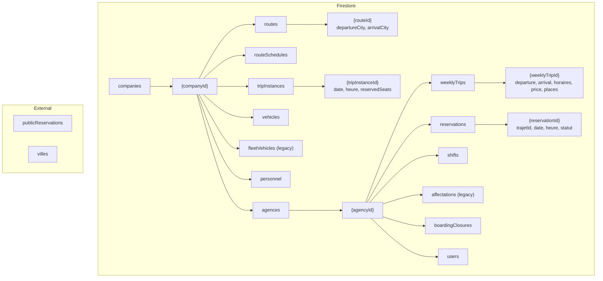

# Audit — Système de gestion des trajets et réservations TELIYA

Objectif : comprendre l’implémentation actuelle des **routes**, **trajets** et **réservations** pour préparer une évolution vers un système complet **réseau de transport (routes + escales + segments)**.

---

## 1. Structure Firestore actuelle

### 1.1 Tableau des collections (transport & réservations)

| Collection | Sous-collection | Champs principaux | Utilisation dans le code |
|------------|-----------------|-------------------|---------------------------|
| **companies** | — | id, nom, slug, couleurPrimaire, code, devise, publicPageEnabled, onlineBookingEnabled, villesDisponibles, … | Résolution par slug (portail public), thème, paramètres. Pas de sous-collection « trajets » : les trajets sont sous agences. |
| **companies/{companyId}/agences** | (documents agence) | id, nomAgence, nom, ville/city/villeNorm, code, telephone, … | Liste des agences ; ville d’agence = point de départ possible. |
| **companies/{companyId}/agences/{agencyId}/weeklyTrips** | — | id, departure, arrival, departureCity, arrivalCity, routeId?, horaires: { [jour]: string[] }, price, places, seats, active, agencyId, vehicleId?, status, updatedAt | **Trajets hebdomadaires** : un document = une liaison départ → arrivée avec des créneaux par jour. Création : `generateWeeklyTrips`, `AgenceTrajetsPage`. Lecture : `ReservationClientPage`, `ResultatsAgencePage`, `AgenceGuichetPage`, `ManagerOperationsPage`. |
| **companies/{companyId}/agences/{agencyId}/reservations** | — | id, trajetId, tripInstanceId?, date, heure, depart, arrivee, nomClient, telephone, seatsGo, seatsReturn, montant, statut, canal, companyId, agencyId, shiftId?, referenceCode, createdAt, … | **Réservations** (guichet + en ligne). Création : `guichetReservationService`, `ReservationClientPage` (addDoc). Requêtes : partout (rapports, guichet, embarquement, comptabilité). |
| **companies/{companyId}/agences/{agencyId}/shifts** | — | id, userId, status, startAt, endAt, … | Sessions guichet (postes de vente). Lié aux réservations via shiftId. |
| **companies/{companyId}/tripInstances** | — | id, companyId, agencyId, agenciesInvolved?, departureCity, arrivalCity (routeDeparture, routeArrival), date, departureTime, weeklyTripId, vehicleId, status, reservedSeats, passengerCount, seatCapacity, capacitySeats, routeId, price, … | **Exécution réelle** d’un trajet (un jour, une heure). Création lazy : `getOrCreateTripInstanceForSlot`. Mise à jour places : `incrementReservedSeats` / `decrementReservedSeats`. Requêtes : `listTripInstancesByRouteAndDate`, `ResultatsAgencePage`, `ReservationClientPage` (si usage tripInstance). |
| **companies/{companyId}/routes** | — | id, departureCity, arrivalCity, distance?, estimatedDuration?, status (ACTIVE/DISABLED) | **Référentiel de routes** compagnie : uniquement **départ → arrivée** (pas d’escales). Utilisé dans `AgenceTrajetsPage` (liste des routes où departureCity === ville agence) pour créer des weeklyTrips avec routeId. |
| **companies/{companyId}/routeSchedules** | — | id, routeId, agencyId, busId, departureTime, daysOfWeek, status | Horaires associés à une route (optionnel). Types présents ; usage limité dans la génération des trajets. |
| **companies/{companyId}/vehicles** | — | id, plateNumber, model, status, currentAgencyId, currentCity, capacity, … | **Flotte** (collection canonique). Lecture/écriture : `vehiclesService`, garage, affectations. |
| **companies/{companyId}/fleetVehicles** | — | (structure proche de vehicles) | **Legacy** : encore lu en fallback (vehiclesService, FleetDashboardPage, etc.). À migrer vers `vehicles`. |
| **companies/{companyId}/personnel** | — | crewRole (driver/convoyeur), assignedVehicleId, … | Équipage compagnie (chauffeurs, convoyeurs). Logistique / garage. |
| **companies/{companyId}/agences/{agencyId}/affectations** | — | (clé = f(departure, arrival, heure, date)) | Affectations véhicule/trajet (legacy). Migration vers fleetVehicles / tripInstances. |
| **companies/{companyId}/agences/{agencyId}/boardingClosures** | — | (fermeture liste embarquement) | Utilisé dans `ManagerOperationsPage` pour savoir si un créneau est fermé à l’embarquement. |
| **villes** | — | (doc id = identifiant) data.nom | Liste des **villes** (noms). `getAllVilles` (villes.service), `useVilleOptions` (suggestions depuis weeklyTrips des agences). Pas de relation formelle avec les routes. |
| **publicReservations** | — | reservationId, companyId, agencyId, slug, publicToken, createdAt | Lookup par token public pour accès billet / paiement sans être connecté. Clé = reservationId. |
| **platform/settings** | — | (logo, bannière, etc.) | Paramètres plateforme (hors transport). |

### 1.2 Relations entre collections

- **Company** → **agences** : une compagnie a N agences (documents dans `agences`).
- **Agence** → **weeklyTrips** : chaque agence a ses propres trajets hebdomadaires (départ souvent = ville de l’agence).
- **weeklyTrips** → **routes** (optionnel) : un weeklyTrip peut avoir un `routeId` (companies/{companyId}/routes/{routeId}). La route ne contient que departureCity et arrivalCity.
- **Réservations** : toujours sous `companies/{companyId}/agences/{agencyId}/reservations`. Liées à un trajet par `trajetId` (composite `weeklyTripId_date_heure` ou `tripInstanceId`) et optionnellement `tripInstanceId`.
- **tripInstances** : au niveau compagnie. Liés à un weeklyTrip via `weeklyTripId`, à une route via `routeId`. Les réservations en ligne peuvent incrémenter `reservedSeats` sur le tripInstance.

---

## 2. Système des trajets

### 2.1 Où les trajets sont créés

- **AgenceTrajetsPage** (`/agence/trajets`) : création / édition / suppression de **weeklyTrips** via `generateWeeklyTrips` (service). Droits : admin_platforme, admin_compagnie, chefAgence.
- **generateWeeklyTrips** : écrit dans `companies/{companyId}/agences/{agencyId}/weeklyTrips`. Un document = une liaison départ → arrivée + grille horaires par jour + prix + places.

### 2.2 Comment ils sont stockés

- **weeklyTrips** (par agence) :
  - **origin / departure** : champs `departure`, `departureCity` (legacy + nouveau).
  - **arrival** : `arrival`, `arrivalCity`.
  - **time** : `horaires` = `{ [jourSemaine]: string[] }` (ex. `{ "lundi": ["08:00", "14:00"], "mardi": ["08:00"] }`). Pas d’heure unique globale.
  - **vehicle** : `vehicleId` optionnel (lien vers véhicule).
  - **price** : `price` (nombre).
  - **agencyId** : `agencyId` (agence propriétaire du trajet).
  - **companyId** : implicite (chemin Firestore).
  - **places / seats** : `places`, `seats` (capacité).
  - **routeId** : optionnel, référence `companies/{companyId}/routes/{routeId}`.
  - **scheduleId** : optionnel (routeSchedules).

- **tripInstances** (compagnie) : un document = **un créneau concret** (date + heure + départ/arrivée). Champs : `agencyId`, `departureCity`, `arrivalCity`, `date`, `departureTime`, `weeklyTripId`, `vehicleId`, `reservedSeats`, `seatCapacity`, `routeId`, `price`, `status`.

### 2.3 Définition actuelle d’un « trajet »

- **Côté offre** : un **weeklyTrip** = une paire (départ, arrivée) + horaires par jour + prix + capacité. Pas de notion de **route réseau** avec escales : uniquement A → B.
- **Côté exécution** : un **tripInstance** = une occurrence (date, heure, A → B, capacité, places réservées).

---

## 3. Logique de génération des trajets (côté UI)

### 3.1 ReservationClientPage (portail public)

- **Source** : `companies/{companyId}/agences/{agencyId}/weeklyTrips` (toutes les agences de la compagnie) + `reservations` de chaque agence.
- **Filtre** : `departure`/`departureCity` et `arrival`/`arrivalCity` normalisés égaux aux paramètres de recherche (departure, arrival).
- **Génération des créneaux** : pour chaque agence, pour chaque weeklyTrip filtré, pour les 8 prochains jours, pour chaque heure dans `horaires[jour]` :
  - identifiant créneau = `trajetId` = `${weeklyTrip.id}_${dateStr}_${heure}` ;
  - **places restantes** = `places` (ou 30) − somme des `seatsGo` des réservations dont `trajetId` égal et statut `confirme` ou `paye`.
- Pas d’appel initial à `tripInstances` : tout est dérivé des weeklyTrips + réservations. Ensuite, à la création de réservation, appel à `getOrCreateTripInstanceForSlot` et `incrementReservedSeats` si tripInstance utilisé.
- **Horaires** : calculés à partir de `horaires[jour]` (jour en français : dimanche, lundi, …). Créneaux passés (même jour) exclus côté client.

### 3.2 ResultatsAgencePage (résultats de recherche publique)

- **Source** : d’abord `listTripInstancesByRouteAndDate(companyId, departure, arrival, date)`. Si aucun tripInstance :
  - parcours de toutes les agences → lecture `weeklyTrips` (active === true) ;
  - pour chaque weeklyTrip dont (departureCity/departure, arrivalCity/arrival) correspondent à la recherche, pour chaque heure de `horaires[jour]` :
    - `getOrCreateTripInstanceForSlot` (création lazy des tripInstances) ;
  - puis rappel de `listTripInstancesByRouteAndDate` pour remplir la liste.
- **Places restantes** : `(seatCapacity ?? 0) - (reservedSeats ?? 0)` sur le tripInstance. Filtre : `status !== 'cancelled'` et remainingSeats > 0.

### 3.3 AgenceGuichetPage (guichet)

- **Source** : `companies/{companyId}/agences/{agencyId}/weeklyTrips` (where active === true) + même agence `reservations` (onSnapshot).
- **Génération** : pour chaque weeklyTrip, pour les 8 prochains jours, pour chaque heure dans `horaires[jour]` :
  - `id` = `${w.id}_${dateISO}_${h}` ;
  - **remainingSeats** = `computeRemainingSeats(w.places || 30, id, allReservations)` = capacité − somme des `seatsGo` des réservations avec ce `trajetId` et statut payé/confirmé.
- Pas de tripInstances dans le flux guichet : tout est basé sur weeklyTrips + réservations en temps réel.

### 3.4 Résumé génération / horaires / places

- **Horaires** : toujours issus de `weeklyTrips[].horaires[jour]` (chaîne type "08:00"). Aucune table « horaires » séparée pour les segments ou escales.
- **Places restantes** :
  - **Avec tripInstances** (ResultatsAgencePage, résa en ligne après lazy create) : `seatCapacity - reservedSeats` sur le document tripInstance ; mise à jour par `incrementReservedSeats` / `decrementReservedSeats`.
  - **Sans tripInstances** (ReservationClientPage ancien mode, Guichet) : calcul en mémoire à partir des réservations dont `trajetId` correspond et statut payé/confirmé.

---

## 4. Logique de réservation

### 4.1 Où les réservations sont créées

- **Guichet** : `createGuichetReservation` → écrit dans `companies/{companyId}/agences/{agencyId}/reservations` (collection ci-dessus). Champs : trajetId, date, heure, depart, arrivee, nomClient, telephone, seatsGo, seatsReturn, montant, statut 'paye', canal 'guichet', shiftId, referenceCode, etc.
- **En ligne (client)** : `ReservationClientPage` → `addDoc(collection(db, 'companies', companyId, 'agences', agencyId, 'reservations'), reservation)` avec statut `en_attente_paiement`, canal `en_ligne`, trajetId, tripInstanceId (si créé). Puis mise à jour avec publicToken, publicUrl ; et écriture dans `publicReservations` pour accès par token.

### 4.2 Champs enregistrés (résumé)

- Identité trajet : `trajetId`, `tripInstanceId` (optionnel), `date`, `heure`, `depart`, `arrivee`.
- Client : `nomClient`, `telephone`, `telephoneNormalized`, `email`.
- Commercial : `seatsGo`, `seatsReturn`, `montant`, `canal`, `statut`, `referenceCode`, `companyId`, `agencyId`, `companySlug`, `shiftId` (si guichet).
- Paiement / preuve : `preuveUrl`, `paymentReference`, etc.
- Audit : `createdAt`, `updatedAt`, `guichetierId`, `shiftId`, etc.

### 4.3 Calcul des places restantes

- Voir section 3 : soit via **tripInstance.reservedSeats** (incrémenté/décrémenté à la création/annulation), soit via **somme des seatsGo** des réservations filtrées par trajetId et statut payé/confirmé.

### 4.4 Statuts des réservations

- Définis dans `reservation.ts` : en_attente, en_attente_paiement, paiement_en_cours, preuve_recue, verification, confirme, payé, embarqué, refusé, annulé, etc. Utilisés dans toute l’app (guichet, portail, comptabilité, embarquement).

---

## 5. Limitations du système actuel

- **Pas de notion de route réseau** : une « route » dans `companies/{companyId}/routes` est uniquement une paire (departureCity, arrivalCity). Pas de liste ordonnée de points (ville1 → ville2 → ville3).
- **Pas de gestion des escales** : aucun concept d’« escale » (arrêt intermédiaire) dans les routes ni dans les weeklyTrips. Le courrier a une notion d’« arrivée escale » (confirmEscaleArrival) pour les lots, mais pas pour les trajets voyageurs.
- **Impossible de vendre un segment intermédiaire** : on ne peut vendre que A → B (départ → arrivée du weeklyTrip). Pas de vente type « Bamako → Ouagadougou » sur une ligne « Bamako → Sikasso → Bobo → Ouagadougou ».
- **Trajets définis seulement par (départ, arrivée)** : un weeklyTrip = une seule paire de villes + horaires. Pas de découpage en segments (A→B, B→C, A→C).
- **Doublon possible offre** : deux chemins (ReservationClientPage vs ResultatsAgencePage) pour construire les créneaux (weeklyTrips + résa vs tripInstances) avec risque d’incohérence si l’un utilise tripInstance et l’autre non.
- **Villes** : collection `villes` indépendante (nom). Pas de lien explicite avec les routes ou les escales. Pas de notion de « gare » ou « point d’arrêt ».
- **routeSchedules** : présents en type (routeId, agencyId, busId, departureTime, daysOfWeek) mais peu utilisés dans la génération actuelle des créneaux par rapport à weeklyTrips.

---

## 6. Rôles actuels (trajets / réservations / guichet)

- **admin_platforme** : accès global, paramètres plateforme, liste compagnies.
- **admin_compagnie (CEO)** : accès compagnie et agences, rapports, réservations, flotte ; pas de rôle « escale » spécifique.
- **chefAgence** : gestion des trajets (AgenceTrajetsPage), guichet, réservations, embarquement, flotte agence.
- **guichetier** : guichet uniquement (vente, poste, reçus).
- **Comptable agence, chef embarquement, agent courrier, responsable flotte, etc.** : voir `ROLES_ET_FONCTIONNALITES_TELIYA.md`.

**Rôle « escale »** : **aucun**. Le terme « escale » apparaît côté **courrier** (arrivée escale d’un lot), pas comme rôle utilisateur. Aucun rôle dédié à la gestion d’escales voyageurs dans le code actuel.

---

## 7. Schéma de l’architecture actuelle

### 7.1 Diagramme logique (Mermaid)



### 7.2 Arborescence Firestore (texte)

```
  companies
  ├── {companyId} ................................. (document compagnie)
  │   ├── routes .................................. (optionnel : départ → arrivée)
  │   │   └── {routeId} ........................... departureCity, arrivalCity, distance, status
  │   ├── routeSchedules .......................... (optionnel : horaires par route/agence)
  │   │   └── {scheduleId} ........................ routeId, agencyId, busId, departureTime, daysOfWeek
  │   ├── tripInstances ........................... (exécution réelle : date + heure + créneau)
  │   │   └── {tripInstanceId} .................... agencyId, departureCity, arrivalCity, date,
  │   │                                            departureTime, weeklyTripId, reservedSeats,
  │   │                                            seatCapacity, routeId, price, status
  │   ├── vehicles ................................ (flotte canonique)
  │   ├── fleetVehicles ............................ (legacy, fallback)
  │   ├── personnel ............................... (chauffeurs, convoyeurs)
  │   └── agences
  │       └── {agencyId} .......................... (document agence : ville, nom, code…)
  │           ├── weeklyTrips ...................... (offre : liaison départ → arrivée + horaires/semaine)
  │           │   └── {weeklyTripId} ............. departure, arrival, horaires{jour[]}, price, places, routeId
  │           ├── reservations .................... (toutes les réservations de l’agence)
  │           │   └── {reservationId} ............. trajetId, tripInstanceId?, date, heure, client, statut, canal…
  │           ├── shifts ........................... (sessions guichet)
  │           ├── affectations ..................... (legacy : affectation véhicule/trajet)
  │           ├── boardingClosures ................. (fermeture listes embarquement)
  │           └── users ............................ (équipe agence)
  │
  publicReservations ............................... (lookup par token public)
  └── {reservationId} ............................. reservationId, companyId, agencyId, slug, publicToken

  villes ........................................... (référentiel noms de villes)
  └── {docId} ..................................... nom
```

### 7.3 Flux logique (résumé)

- **Company** a N **agences**. Chaque **agence** a ses **weeklyTrips** (trajets hebdo A→B + horaires).
- Les **réservations** sont toujours sous **agence** ; elles référencent un créneau via `trajetId` et optionnellement `tripInstanceId`.
- Les **tripInstances** (compagnie) représentent les créneaux réels (date, heure, A→B) et portent les **places réservées** pour la résa en ligne (ResultatsAgencePage + ReservationClientPage).
- **routes** / **routeSchedules** existent mais ne portent pas d’escales ; ils servent surtout à l’édition des weeklyTrips (AgenceTrajetsPage) avec routeId.

---

## 8. Impacts d’un système routes + escales + segments

### 8.1 Modèles de données

- **routes** : faire évoluer d’une paire (departureCity, arrivalCity) vers une **séquence ordonnée de points** (escales). Nouveaux champs possibles : `stops: { order, cityId, name, … }` ou sous-collection `routeStops`.
- **Segments** : dérivés des routes (A→B, B→C, A→C, etc.). Soit stockés (collection `segments` ou champs sur la route), soit calculés à la lecture. Impact : **routeSchedules**, **weeklyTrips** (ou équivalent) devront référencer un **segment** ou une **route + segment**.
- **tripInstances** : aujourd’hui un instance = un créneau A→B. Avec segments : une instance pourrait représenter un « trajet long » avec plusieurs segments ; les places restantes pourraient être par segment (A→B, B→C) ou globales selon le modèle métier.
- **Réservations** : ajout de champs type `segmentId`, `boardingStop`, `alightingStop` (ou équivalent) pour vendre un segment intermédiaire. Impact : **companies/…/agences/…/reservations** et tout calcul de places (tripInstance ou agrégat).

### 8.2 Fichiers / zones impactés (liste non exhaustive)

| Fichier / zone | Impact probable |
|----------------|-----------------|
| **routesTypes.ts**, **routesService.ts** | Étendre RouteDoc avec escales (ou sous-collection). CRUD routes avec stops. |
| **routeSchedulesTypes.ts**, **routeSchedulesService.ts** | Lier à un segment ou à une route + indices d’escales. |
| **weeklyTrip.ts**, **generateWeeklyTrips.ts** | Dépendre d’une route (avec escales) et/ou de segments ; possiblement un weeklyTrip par segment ou par route complète. |
| **tripInstanceTypes.ts**, **tripInstanceService.ts** | Représenter segment(s) ou route + escales ; gérer reservedSeats par segment si besoin. |
| **ReservationClientPage.tsx** | Recherche par segment (départ/arrivée = escales), affichage des trajets par segment, création résa avec segment/boarding/alighting. |
| **ResultatsAgencePage.tsx** | Même logique : créneaux par segment, places restantes par segment. |
| **AgenceGuichetPage.tsx** | Choix du segment (ou route + escales) à la vente ; calcul des places par segment. |
| **AgenceTrajetsPage.tsx** | Création/édition d’offre basée sur routes à escales et segments. |
| **guichetReservationService.ts** | Champs réservation : segmentId, boardingStop, alightingStop (ou équivalents). |
| **Reservation (types)** | Étendre avec champs segment / escale montée / escale descente. |
| **villes** / référentiel | Possiblement lier à des « points d’arrêt » ou « gares » (id pour escales). |
| **Fleet / affectations** | Affectation véhicule à une route (multi-escales) ou à des segments. |
| **Embarquement** | Scanner par escale (où le passager monte/descend) si on gère les segments. |

### 8.3 Points d’attention

- **Index Firestore** : requêtes par segment, par (routeId, date, segmentId), etc. À prévoir selon le modèle retenu.
- **Rétrocompatibilité** : trajets actuels (weeklyTrips A→B sans escale) à considérer comme « route à 2 escales » pour ne pas casser l’existant.
- **Prix** : aujourd’hui un prix par weeklyTrip (A→B). Avec segments : prix par segment ou matrice (origine × destination) à définir.
- **Rôles** : si gestion d’escales (ex. « responsable escale »), à ajouter dans `roles-permissions` et dans les écrans concernés.

---

*Document généré à partir du code (Firestore paths, types, services, pages). Dernière mise à jour : mars 2025.*
